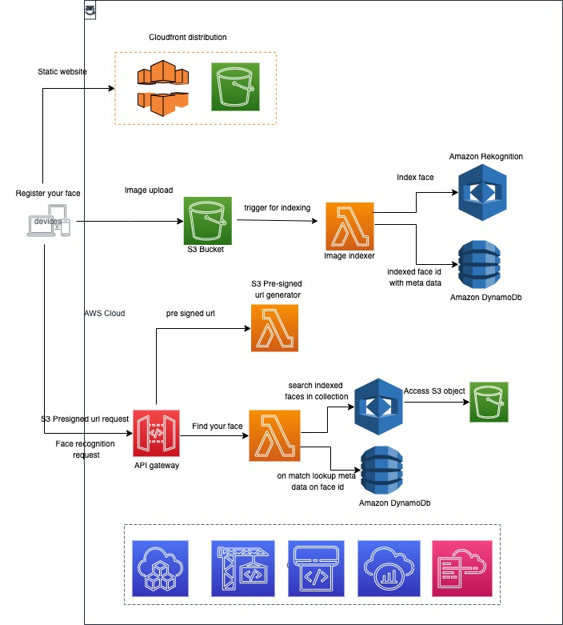

# serverless-webapp-ci-cd-java

__Status__: _Work-in-progress. Please create issues or pull requests if you have ideas for improvement._

Use AWS Serverless stack to build a full fledged web application with both
backend and frontend hosted inside a same mono repo.

Backend CI/CD pipeline and backend infrastructure is written using SAM.
Frontend CI/CD pipeline and infrastructure is written using CDK Java.

Application builds a React static web app, which talks to bunch of APIs hosted via API gateway and talking to 
lambda functions, S3 and dynamoDB as backends. Feature of web application itself is simple. Since that is not the main 
purpose here.  User can basically upload an image with a metadata. Then if user want, they can try uploading 
another image from another flow, and try to find face in it. If its found in Dynamo DB, then
we return the metadata. 

## Architecture diagram for the application



## Pre requisite

Make sure you have [aws cli](https://github.com/aws/aws-cli#getting-started) installed and configured with an aws account you want to use.


## Creating backend

Assuming your region is `eu-west-1`, run below commands. Replace region value with your workload region.

- Create backend CI/CD pipelines for deploying backend resource via cloudformation.  You can either choose 
to deploy backend in python or in java. Both are deployed via SAM.

###### Java Backend
```
    aws cloudformation create-stack --stack-name serverless-web-application-java-backend-pipeline --template-body file://java-app-backend/serverless-pipeline.yaml --capabilities CAPABILITY_AUTO_EXPAND CAPABILITY_IAM --region eu-west-1
```

- Trigger Code build for deploying java backend resources via pipeline. It will use SAM to deploy serverless backend stack.

```
    aws codebuild start-build --project-name WebAppJavaBackendPipelineDetector --region eu-west-1
``` 

###### Python Backend
```
    aws cloudformation create-stack --stack-name serverless-web-application-python-backend-pipeline --template-body file://python-app-backend/serverless-pipeline.yaml --capabilities CAPABILITY_AUTO_EXPAND CAPABILITY_IAM --region eu-west-1
```

- Trigger Code build for deploying python backend resources via pipeline. It will use SAM to deploy serverless backend stack.

```
    aws codebuild start-build --project-name WebAppPythonBackendPipelineDetector --region eu-west-1
``` 

- After this step, codepipeline should take care of deploying your backend resources. If you choose to deploy with manual approval step, Navigate to [pipeline](https://eu-west-1.console.aws.amazon.com/codesuite/codepipeline/pipelines/WebApplicationBackendPipeline/view?region=eu-west-1) 
and approve to deploy the stack.


## Creating frontend

Assuming your region is `eu-west-1`, run below commands. Replace region value with your workload region.

- Update backend endpoints in [GlobalConstants](frontend/src/GlobalConstants.ts). Backend endpoints can be found 
by navigating to [API gateway console](https://eu-west-1.console.aws.amazon.com/apigateway/main/apis?region=eu-west-1)

- Revisit [cdk.json](frontend-infrastructure/cdk.json) for configurtion of frontend stack. 
You might want to update `approval_emails`, `cert_domain`. If you don't want to host on a custom domain, 
leave `cert_domain` as empty string. Leaving `approval_emails` as empty won't create any approval stage.

- Create frontend CI/CD pipelines for deploying frontend resource via cdk. 

```
    cd frontend-infrastructure/
```
```  
    maven clean install
```
```
    cdk synth serverless-web-application-frontend-pipeline --region eu-west-1
```
```
    cdk bootstrap
```
```
    cdk deploy serverless-web-application-frontend-pipeline --region eu-west-1 --require-approval never
```

- Trigger Code build for deploying backend resources via pipeline. It will use SAM to deploy serverless backend stack.

```
    aws codebuild start-build --project-name WebApplicationFrontEndPipelineDetector --region eu-west-1
``` 

- If you are using custom domain, make sure to register created named servers on Route53 hosted zone with your domain 
provider.  

- 1st deployment of frontend will take some time since its need to initialise cloudfront distribution etc.

- After this step, codepipeline should take care of deploying your frontend resources. If you choose to deploy with manual approval step, Navigate to [pipeline](https://eu-west-1.console.aws.amazon.com/codesuite/codepipeline/pipelines/WebApplicationBackendPipeline/view?region=eu-west-1) 
and approve to deploy the stack.


## Security

See [CONTRIBUTING](CONTRIBUTING.md#security-issue-notifications) for more information.

## License

This library is licensed under the MIT-0 License. See the LICENSE file.

